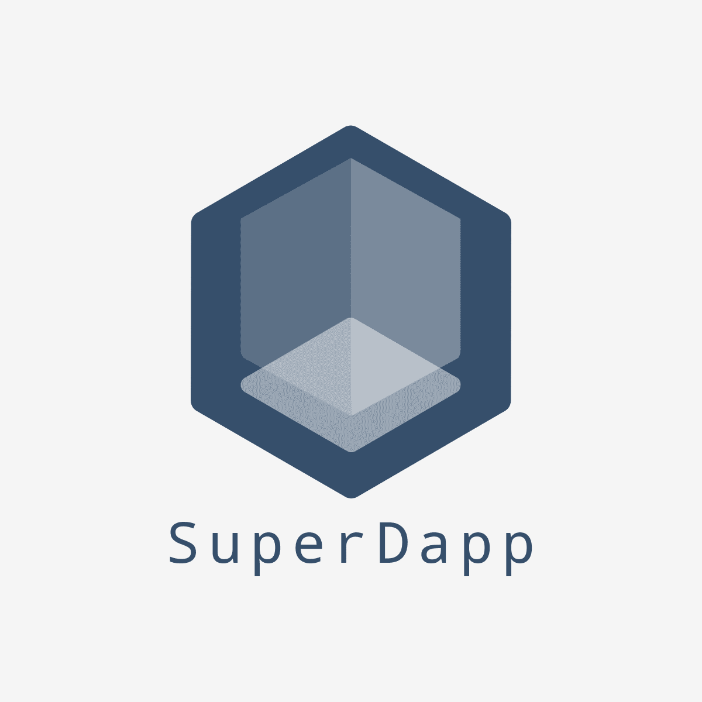
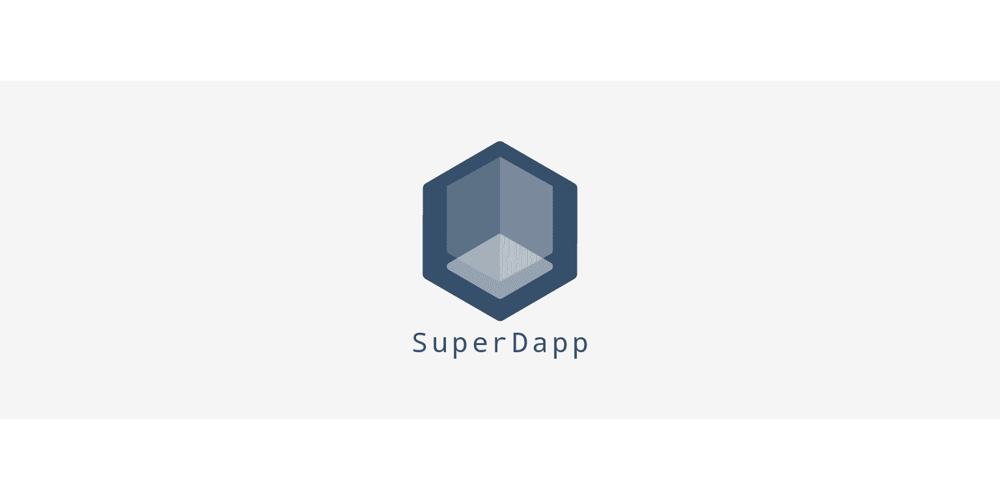

# SuperDapp

## Short description

### A max 280-character or less description of your project (it should fit in a tweet!)

Exchange onramp/offramp using state channels hub-and-spoke model

## Long description

### Go in as much detail as you can about what this project is. Please be as clear as possible!

This project combines a state channels hub and browser-based frontend to allow users to deposit and withdraw tokens to their favourite exchanges instantly. The hub is designed to...

## How It's Made

### Tell us about how you built this project; the nitty-gritty details. What technologies did you use? How are they pieced together? If you used sponsor technology how did it benefit your project? Did you do anything particularly hacky that's notable and worth mentioning? How did you impress yourself which what your team built?

This project uses the @statechannels browser-based wallet behind the scenes to connect to Coinbase and Bitfinex APIs. We used MobX to design the frontend and the backend is built in Rust.

## Logo

### A square image (i.e 512x512) that can behave like a logo or an icon.

## Cover image

### The ideal aspect ratio is 16:9 - for example 640x360 px.

## Screenshots

### Upload screenshots that you think represent the hack.

## Demo Video (Optional)

### Please record and upload a short demo. Here are some important things to consider:
